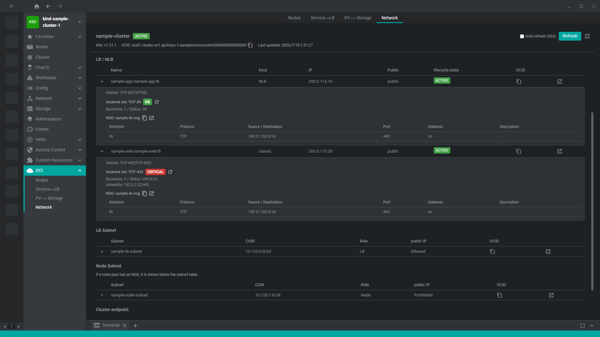

# freelens-oci-cluster

See the OCI resources backing your open cluster, right in FreeLens.

[日本語](README.md)

FreeLens shows Kubernetes resources, but when a cluster runs on Oracle Cloud Infrastructure (OCI) — for example an OKE cluster — there is no built-in way to see the underlying OCI resources a Node, a Service of type LoadBalancer, or a PersistentVolume maps to (the Instance, the NLB/classic LB, the Block Volume/FSS).

`freelens-oci-cluster` adds an "OCI" cluster sidebar menu that automatically resolves and displays these OCI resources for the currently open cluster, starting from each Node's `providerID`.
See [docs/design.md](docs/design.md) for the full design rationale, including how cluster-related resources are resolved and the known limitations.

## Prerequisites

- The `oci` CLI installed and authenticated against the target tenancy (e.g. via `oci session authenticate`)
- The invoked `oci` command can be overridden in Preferences (see Settings below)

## Compatibility

Requires FreeLens 1.8.0 or later (see `engines` in package.json).
Verified on FreeLens 1.10.3 (Extension API 1.10.3, Windows x64).

## Install

1. Download the latest `.tgz` from [GitHub Releases](https://github.com/AvapCoLtd/freelens-oci-cluster/releases)
2. Drag & drop it onto the Extensions screen in FreeLens
3. To update, repeat the same steps with the new `.tgz`

## Usage

1. Deploy the extension and connect to a cluster in FreeLens
2. Click the "OCI" menu in the cluster sidebar
3. For OKE clusters, a header shows cluster info, and sub-menus under "OCI" (Nodes / Service↔LB / PV↔Storage) switch between resource pages.
   For non-OKE clusters, an out-of-scope guidance message is shown instead.

It is read-only: it never calls any OCI operation that mutates resources.

### Settings

FreeLens Preferences has an "OCI" section with an "OCI command" field.

- Leave it blank to use the default command `oci` (shown as the placeholder)
- It can include extra arguments, e.g. `oci --profile FOO`; the string is split on whitespace into command arguments
- Changes take effect on the next data fetch (the refresh button, or reselecting the cluster)

Development: see [CONTRIBUTING.md](CONTRIBUTING.md).

## Links

- https://github.com/AvapCoLtd/freelens-oci-cluster (public)
- https://gitlab.avaper.day/avap/freelens-plugins/freelens-oci-cluster (development)

## License

MIT
