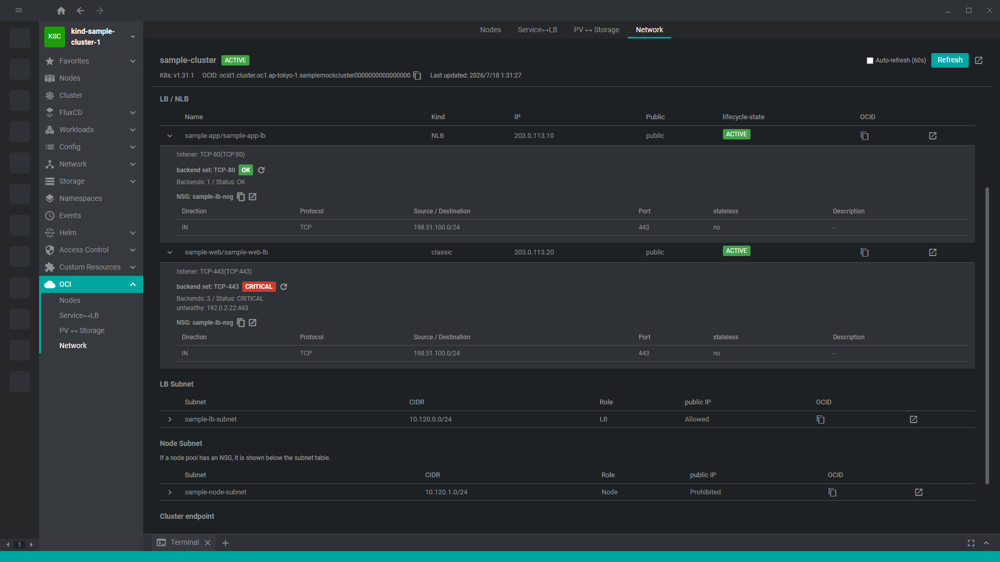

# freelens-oci-cluster


See the OCI resources backing your open cluster, right in FreeLens.



[日本語](README.md)

FreeLens shows Kubernetes resources.
A cluster may run on Oracle Cloud Infrastructure (OCI) — for example an OKE cluster.
In that case, there is no built-in way to see the corresponding OCI resources.

- Node → Instance
- Service (type=LoadBalancer) → NLB / classic LB
- PersistentVolume → Block Volume / FSS

`freelens-oci-cluster` adds an "OCI" cluster sidebar menu.
For the currently open cluster, it automatically resolves and displays these OCI resources, starting from each Node's `providerID`.
See [docs/design.md](docs/design.md) for the design rationale and domain knowledge, including how the mappings are resolved and the known limitations.

## Prerequisites

You need an environment where the `oci` CLI (or a compatible command that accepts the same arguments) runs.
The plugin spawns this command as a child process on every data fetch and reads the JSON it writes to stdout.

- `oci` is on `PATH` and authenticated.
  Any authentication method works (API key auth via `~/.oci/config`, session token auth via `oci session authenticate`, and so on)
- Even in environments that keep no config file on disk (e.g. secret-manager-based operations), you can point the plugin
  at a wrapper command that injects the credentials and launches `oci` (see "Settings" below)
- The plugin never receives keys or tokens. Authentication is handled entirely inside `oci`

## Compatibility

Requires FreeLens 1.8.0 or later (see `engines` in package.json).
Verified on FreeLens 1.10.3 (Extension API 1.10.3, Windows x64).

## Install

1. Download the latest `.tgz` from GitHub Releases: <https://github.com/AvapCoLtd/freelens-oci-cluster/releases>
2. Drag & drop it onto the Extensions screen in FreeLens
3. To update, repeat the same steps with the new `.tgz`

## Usage

1. Deploy the extension and connect to a cluster in FreeLens
2. Click the "OCI" menu in the cluster sidebar
3. For OKE clusters, a header shows cluster info.
   The sub-menus under "OCI" (Nodes / Service↔LB / PV↔Storage / Network) switch between resource pages.
   For non-OKE clusters, an out-of-scope guidance message is shown instead.

Main features per page.

- **Nodes**: the mapping between K8s Nodes and OCI Instances, plus a node pool summary
- **Network**: walk a "the Service is unreachable" investigation in outside-in path order
  (DNS cross-check → WAF → LB/NLB → security lists and route tables of the LB subnet → those of the node subnet → cluster endpoint).
  Expanding a row shows security rules, WAF policies, certificate expiry, routes (whether the gateway on the path is alive),
  and backend health (detecting unhealthy backends)
- **PV↔Storage**: the mapping to Block Volume / FSS and the backup (snapshot) policies

A toggle in each page header enables auto-refresh (the interval is configurable in Preferences, 60 seconds by default).

It is read-only.
This plugin never performs any operation that mutates OCI resources.

### Settings

FreeLens Preferences has an "OCI: oci command" field for the command to execute.

- When blank, the `oci` on `PATH` is executed (this is usually enough)
- When set, the value is executed as an oci-compatible command.
  Leading arguments are allowed, e.g. `oci --profile foo`
- The value is split on whitespace into the executable and its leading arguments.
  Quotes are not interpreted, so a single argument containing whitespace cannot be expressed
- Changes take effect from the next data fetch (the refresh button, or reselecting the cluster)

Example configuration for running FreeLens on Windows while `oci` lives on the WSL side.

```text
wsl oci
```

If you keep no `~/.oci/config` on the WSL side and instead have a wrapper that injects credentials from a secret
manager before launching `oci`, point the setting at that wrapper (e.g. `wsl haj oci`).

### Compatible command contract

Requirements for a command specified in place of `oci`.

- It forwards the given arguments to `oci` as-is and passes stdout, stderr, and the exit status straight through
- It accepts the subcommands the plugin runs.
  [src/renderer/cli/command-defs.ts](src/renderer/cli/command-defs.ts) is the single source of truth for the full list
  (read-only `get` / `list` / `search` operations only; it is not duplicated here)
- Output contract
  - The plugin adds `--output json` to every call. Stdout is the same JSON as `oci` produces (`{"data": …}`)
  - `--all` is added to list operations. Only `search resource structured-search`, which has no `--all`,
    is paged manually with `--page`, following the top-level `opc-next-page`.
    Manual paging is capped at 100 pages; exceeding it fails only that section
  - Success is exit status 0. Output on stderr is still treated as success as long as the status is 0
  - Failure is a non-zero exit status. The error category (authentication / permission or not-found / other)
    is determined from the `ServiceError:` JSON on stderr
- Each call times out after 60 seconds. At most 8 processes run concurrently, and stdout of a single call is
  capped at 64MiB (exceeding it fails only that section)

The contract assumes stdout and stderr contain no secrets, so error messages show the exit status and stderr verbatim.

### Migrating from the old "credentials command"

The Preferences "credentials command" of the 0.2 series (a command that returned a credentials JSON on stdout) has been removed.
This is a breaking change, and setting values are not migrated automatically.

- The old setting value remains in the settings file, but the plugin never reads it (nor runs it as the oci command)
- Configure the "OCI: oci command" field again
  - Environments with `~/.oci/config`: leave it blank
  - Environments that used a credentials command such as `wsl haj oci-cred-json`: specify a command that runs
    `oci` on the WSL side, e.g. `wsl oci` (let the command itself handle credential injection)

Development: see [CONTRIBUTING.md](CONTRIBUTING.en.md).

## Links

- https://github.com/AvapCoLtd/freelens-oci-cluster (public)
- https://gitlab.avaper.day/avap/freelens-plugins/freelens-oci-cluster (development)

## License

MIT
